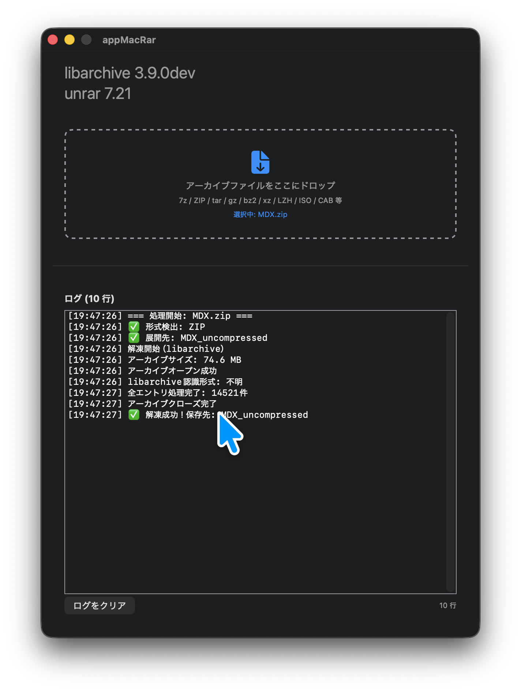

# MacRar

macOS 向けマルチフォーマットアーカイブ展開アプリ。ドラッグ＆ドロップで簡単に解凍できます。

RAR/RAR5 は unrar CLI、それ以外の形式は libarchive を静的リンクで内蔵しており、Homebrew 等の外部パッケージマネージャに依存しません。

## 対応形式

| 形式 | エンジン | 備考 |
|------|----------|------|
| RAR / RAR5 | unrar 7.21 | マルチスレッド解凍（`-mt2`） |
| 7z | libarchive | 日本語ファイル名対応 |
| ZIP | libarchive | jar/war/ear/xpi 含む |
| tar / tgz / tbz / txz | libarchive | 透過フィルタ処理 |
| GZIP / BZIP2 / XZ / LZIP | libarchive | |
| LHA / LZH | libarchive | `-lh5-`〜`-lh7-` |
| ISO | libarchive | |
| CAB | libarchive | |
| ARJ | libarchive | |
| CPIO | libarchive | |
| Z (compress) | libarchive | |

形式はマジックバイトで自動判別するため、拡張子を意識せずに使えます。

## スクリーンショット



## システム要件

- macOS 13.0+
- Apple Silicon（arm64）

## アーキテクチャ

```
アーキテクチャ: MVVM
UI フレームワーク: SwiftUI + AppKit（NSTextView）
プロジェクト生成: XcodeGen（project.yml）
```

### 解凍エンジン

```
ユーザーがファイルをドロップ
       │
       ▼
  マジックバイト判定
       │
       ├── RAR ──→ unrar x（Process 呼び出し）
       │
       └── 他形式 ──→ ArchiveExtractor（libarchive C API）
                       7z/ZIP/gz/bz2/xz/LZH/ISO/CAB/ARJ/CPIO/Z
```

### セキュリティ対策

- パストラバーサル防止（`NODOTDOT` + `NOABSOLUTEPATHS`）
- シンボリックリンク攻撃防止（`SECURE_SYMLINKS`）
- エントリ数上限 500,000 で DoS 対策
- libarchive は最新 master 追従、既知 CVE は解消済み

## プロジェクト構成

```
appMacRar/
├── .gitignore
├── project.yml                XcodeGen プロジェクト定義
├── appMacRar.xcodeproj/
│   └── project.pbxproj        Xcode プロジェクトファイル
├── Package.swift              SwiftPM（現状 unused）
├── LICENSE                    Apache 2.0
├── Libs/
│   ├── unrar/
│   │   ├── unrar              プリコンパイル済みバイナリ
│   │   └── license.txt        unrar ライセンス
│   └── libarchive/
│       ├── libarchive.a       静的ライブラリ（arm64）
│       ├── archive.h          公開ヘッダ
│       ├── archive_entry.h    公開ヘッダ
│       └── COPYING            BSD 2-Clause ライセンス
├── appMacRar/
│   ├── AppEntry.swift         @main エントリポイント
│   ├── ArchiveFormat.swift    マジックバイト判定（13形式）
│   ├── ArchiveExtractor.swift libarchive C API ラッパー
│   ├── BridgingHeader.h       archive.h / archive_entry.h
│   ├── Info.plist
│   ├── Models/
│   │   └── UnrarArchive.swift モデル
│   ├── ViewModels/
│   │   └── ArchiveViewModel.swift 解凍ロジック + 状態管理
│   ├── Views/
│   │   ├── MainView.swift     メイン画面（ドロップゾーン + ログ）
│   │   └── LogTextView.swift  NSTextView ラッパー
└── docs/
    ├── archive-format-expansion.md  設計書
    └── build-error-fixes.md         ビルドエラー対策
```

## ビルド手順

### 前提条件

- macOS 13.0+
- Xcode 17+（Command Line Tools 含む）
- [XcodeGen](https://github.com/yonaskolb/XcodeGen)（`brew install xcodegen`）

### 手順

```bash
# 1. Xcode プロジェクト生成
xcodegen generate

# 2. Xcode で開く
open appMacRar.xcodeproj

# 3. ビルド & 実行（Cmd+R）
```

## 使用方法

1. アプリを起動
2. アーカイブファイルをドロップゾーンにドラッグ＆ドロップ
3. 自動で形式判定され解凍開始、ログに進捗が表示される
4. 解凍完了後、元ファイルと同じ場所に `ファイル名_uncompressed/` が作成され、Finder で自動的に開く

### unrar の更新手順

```bash
# <unrar-original> でビルド後
cp unrar <project_dir>/Libs/unrar/unrar
```

### libarchive の更新手順

```bash
cd <libarchive-source-dir>

cmake -B build \
  -DCMAKE_BUILD_TYPE=Release \
  -DCMAKE_OSX_ARCHITECTURES="arm64" \
  -DENABLE_TAR=OFF -DENABLE_CPIO=OFF -DENABLE_CAT=OFF \
  -DENABLE_UNSHAR=OFF -DENABLE_NETTLE=OFF -DENABLE_OPENSSL=OFF \
  -DENABLE_LZ4=OFF -DENABLE_ZSTD=OFF -DENABLE_EXPAT=OFF \
  -DENABLE_PCREPOSIX=OFF -DENABLE_LIBXML2=OFF -DENABLE_TEST=OFF \
  -DENABLE_LZO=OFF -DENABLE_CNG=OFF -DENABLE_LIBB2=OFF

cmake --build build

cp build/libarchive/libarchive.a <project_dir>/Libs/libarchive/
cp libarchive/archive.h          <project_dir>/Libs/libarchive/
cp libarchive/archive_entry.h    <project_dir>/Libs/libarchive/
```

## ライセンス

### MacRar（アプリケーション本体）

Apache License 2.0 — 詳細は [LICENSE](LICENSE) を参照。
Copyright 2026 ktam72

### 使用ライブラリ

| ライブラリ | ライセンス | 配置 |
|-----------|-----------|------|
| libarchive | BSD 2-Clause | `Libs/libarchive/COPYING` |
| unrar | unrar freeware license | `Libs/unrar/license.txt` |
